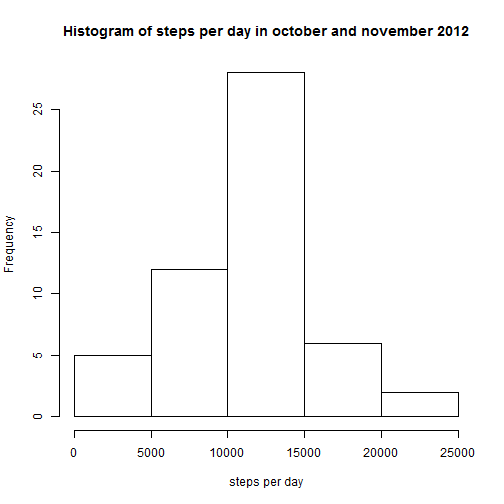
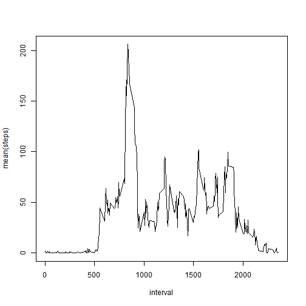
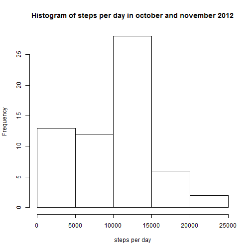
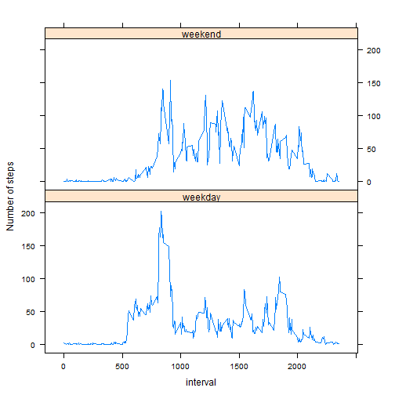

## Loading and preprocessing the data

```r
raw <- read.csv("activity.csv")
```

## What is mean total number of steps taken per day?

The data contains NA values. First these NA values will be removed. After that the data will be grouped by date and per date the sum of the steps are computed. 

```r
library(dplyr)
x <- na.omit(raw)
x <- x %>% group_by(date) %>% summarize(sum(steps))

hist(x$`sum(steps)`, 
     xlab = "steps per day", 
     main = "Histogram of steps per day in october and november 2012")
```

 

The mean and median of the total number of steps taken per day is computed with the following code:

```r
mean(x$`sum(steps)`)
```

```
## [1] 10766.19
```

```r
median(x$`sum(steps)`)
```

```
## [1] 10765
```


## What is the average daily activity pattern?


```r
y <- na.omit(raw)
y <- y %>% group_by(interval) %>% summarize(mean(steps))

with(y, plot(interval, `mean(steps)`, 
             type = "l")
     )
```

 


## Imputing missing values

The NA values within this dataset are located within the variable "steps". 

```r
summary(raw)
```

```
##      steps                date          interval     
##  Min.   :  0.00   2012-10-01:  288   Min.   :   0.0  
##  1st Qu.:  0.00   2012-10-02:  288   1st Qu.: 588.8  
##  Median :  0.00   2012-10-03:  288   Median :1177.5  
##  Mean   : 37.38   2012-10-04:  288   Mean   :1177.5  
##  3rd Qu.: 12.00   2012-10-05:  288   3rd Qu.:1766.2  
##  Max.   :806.00   2012-10-06:  288   Max.   :2355.0  
##  NA's   :2304     (Other)   :15840
```

```r
z <- length(subset(raw, is.na(raw$steps))$interval)
```

The number of rows with missing values are 2304.

To fill in the missing values, the presumption is made that no steps have been taken. For that reason the values of steps during that interval should be zero.

A new dataset will be created based on this presumption and this dataset will hold the name "a".


```r
a <- raw
a$date <- as.character(a$date)
a <- for(i in seq_along(a$interval)) { 
      b <- data.frame(steps = numeric(0),
                         date = character(0),
                         interval = integer(0))
      if(is.na(a$steps[i]) == TRUE) {
            a$steps[i] <- 0
      }
      b <- bind_rows(b, a)
}
```

The meean and median of the dataset without NA values is calculated below.

```r
c <- b %>% group_by(date) %>% summarize(sum(steps))

hist(c$`sum(steps)`, 
     xlab = "steps per day", 
     main = "Histogram of steps per day in october and november 2012")
```

 

```r
mean(c$`sum(steps)`)
```

```
## [1] 9354.23
```

```r
median(c$`sum(steps)`)
```

```
## [1] 10395
```

The mean and median are lower than computed ealrier in this assigment. This is a logical consequence of the adjustment of the NA values in zero-values.

## Are there differences in activity patterns between weekdays and weekends?


```r
d <- b
d$day <- weekdays(as.POSIXct(d$date), abbreviate = TRUE)

d <- for(i in seq_along(d$interval)) { 
      e <- data.frame(steps = numeric(0),
                      date = character(0),
                      interval = integer(0),
                      day = character(0))
      if(d$day[i] == "za" | d$day[i] == "zo") {
            d$day[i] <- "weekend"
      } else { d$day[i] <- "weekday" }
      e <- bind_rows(e, d)
}

f <- e %>% group_by(day, interval) %>% summarize(mean(steps))

library(lattice)

xyplot(`mean(steps)` ~ interval | day, 
       data = f, 
       layout = c(1,2),
       type = "l",
       ylab = "Number of steps")
```

 

